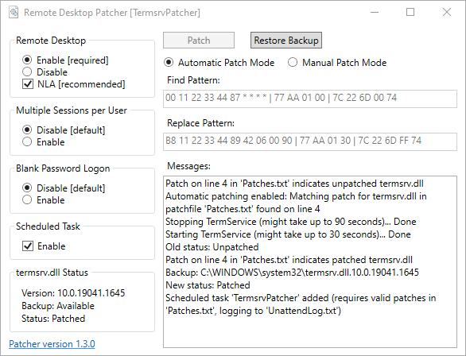

# TermsrvPatcher

TermsrvPatcher simplifies the process of patching the termsrv.dll file for enabling concurrent remote desktop sessions 
on non-server Windows editions. It also eliminates the need for manipulating termsrv.dll permissions by performing the 
file write operations as TrustedInstaller (using the NSudo Devil Mode) and it also takes care for stopping and 
starting the Remote Desktop Service.

Multiple find/replace patterns and wildcards are supported, see the included patchfile for examples.

## RDP Settings

Remote desktop can directly be enabled from the application, including the network level authentication setting. 
It also allows to configure additional options for enabling blank password logon or multiple sessions per user.

## Scheduled Task

A scheduled task can be added to patch termsrv.dll at startup in unattended mode (runs the patcher with the command 
line parameter "-unattended"). This may re-enable concurrent remote desktop sessions after Windows updates as long as 
a valid patch is available in the patchfile (taking advantage of the wildcard support for patches increases the 
chances that patches also match after Windows feature updates).

## Disclaimer

For legal reasons, only example patches are available in the included Patches.txt file.

## Download

[Latest version](../../releases/latest)

## System Requirements

- Windows 7 or newer
- 32-bit (x86) or 64-bit (AMD64) operating system
- .NET Framework 4.7.2 or newer

## Screenshot

