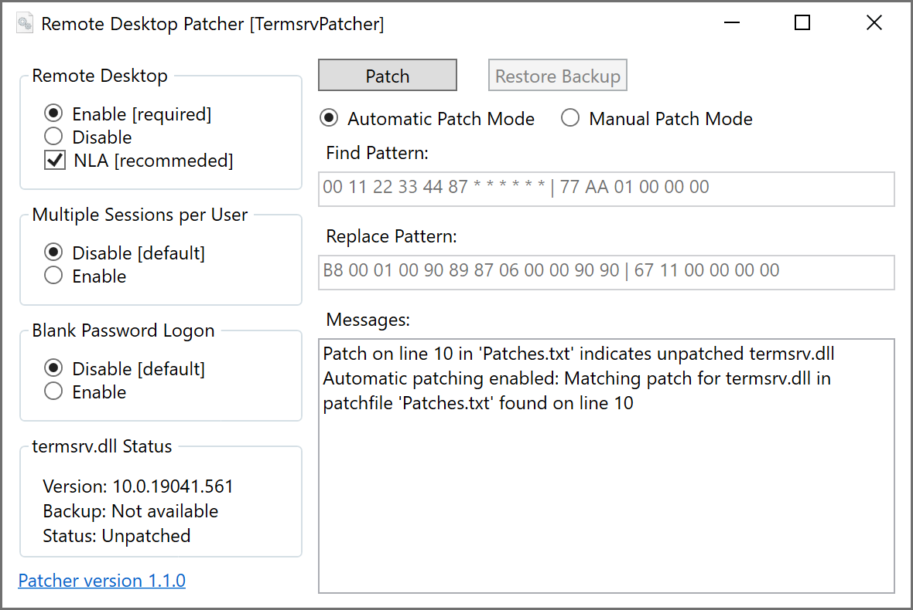

# TermsrvPatcher

TermservPatcher simplifies the process of patching the termsrv.dll file for enabling concurrent remote desktop sessions on non-server Windows editions.

## RDP Settings

Remote desktop can directly be enabled from the application, including the network level authentication setting. It also allows to configure 
additional options for enabling blank passwort logon or multiple sessions per user.

## Download

[Latest version](../../releases/latest)

For legal reasons, only example patches are available in the included Patches.txt file.

## System Requirements

- Windows 7 or newer
- 32-bit (x86) or 64-bit (AMD64) operating system
- .NET Framework 4.7.2 or newer

## Screenshot

